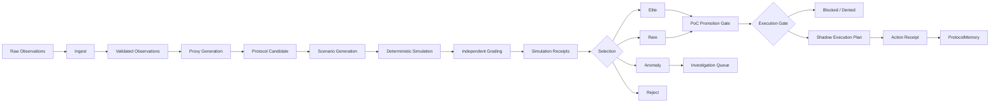

# LoPAS Protocol Foundry

LoPAS Protocol Foundry is an **experimental local runtime for turning fragmented observations into traceable Protocol Candidates, testing them against explicit scenarios, selecting and routing them through conservative promotion gates, and compiling qualified candidates into no-side-effect Shadow Execution Plans and Action Receipts.**

```text
Observation
→ Ingest
→ Proxy
→ Protocol Candidate
→ Simulation and Independent Grading
→ Selection
→ PoC Promotion
→ Shadow Execution Plan
→ Action Receipt
→ ProtocolMemory
```

Raw observations are materials, not instructions.

The Foundry does not treat a post, complaint, meeting note, idea, or workaround as an executable workflow. It first converts source material into an inspectable candidate with explicit inputs, conditions, routes, safety boundaries, provenance, activation requirements, and failure behavior.

> **Project status: v0.1 local Foundry runtime.**  
> The repository contains executable stage-local pipelines, an integrated local runner, deterministic Selection and Routing, and a conservative Promotion-to-Shadow boundary. It is **not** a production service, autonomous executor, or live external-action runtime.

---

## Why This Exists

Most AI automation begins after a workflow has already been defined:

```text
Human-defined workflow
→ AI agent
→ execution
```

LoPAS Protocol Foundry explores the layer before that:

```text
Distributed observations
→ reusable structure
→ candidate workflows
→ scenario-based evaluation
→ evidence-aware promotion
→ limited and reversible PoC
```

The goal is not to ask an LLM for one “best idea.” The goal is to provide a pipeline that can:

- preserve source evidence separately from interpretation;
- normalize repeated friction into reusable Proxies;
- generate explicit Protocol Candidates rather than hidden instructions;
- test candidates under nominal, boundary, adversarial, and failure conditions;
- compare expected behavior with simulated actual behavior;
- preserve strong, unusual, anomalous, and rejected candidates;
- promote only qualified candidates toward controlled real-world testing;
- stop safely when evidence, authority, approval, or bindings are incomplete;
- record meaningful transformations and decisions as receipts.

Simulation is not proof of real-world effectiveness. A generated protocol remains a candidate until it passes explicit promotion gates.

---

## Current Scope

### Implemented and inspectable

- versioned YAML schemas for the major stage boundaries;
- deterministic local Ingest, Proxy, Protocol, Simulation, Selection, and Routing stages;
- synthetic scenario generation and independent grading inside the Simulation stage;
- stage-local command-line interfaces;
- one-process orchestration through `python -m src.foundry`;
- Selection archives for `elite`, `rare`, `anomaly`, and `reject`;
- evidence-aware PoC promotion decisions;
- an optional Promotion-to-Shadow execution boundary;
- Adapter Binding validation without invoking adapters;
- Shadow Execution Plans and Action Receipts with zero external effects;
- a manually inspectable sample trace;
- a synthetic Level 3 READY fixture;
- regression tests for the integrated runner and execution gate.

### Not implemented as production capability

- live Adapter invocation;
- autonomous external execution;
- production source integrations;
- a human-review console;
- a hosted API or stable SDK;
- complete historical replay infrastructure across real operational logs;
- production-grade secrets, identity, authorization, and tenancy;
- ProtocolMemory feedback automation;
- guarantees that simulation predicts real-world performance.

Interfaces, filenames, schemas, and runtime behavior may still change during v0.1.

---

## Core Pipeline



The executable local path currently reaches the Shadow boundary. Shadow mode describes and records what would execute, but does not call tools, LLMs, humans, APIs, or external systems.

---

## Quick Start

### Requirements

- Python 3.11 or later
- PyYAML
- jsonschema with format support

Install the project locally:

```bash
python -m pip install -e .
```

Run the tests:

```bash
python -m unittest \
  tests.test_execution_gate \
  tests.test_execution_pipeline \
  tests.test_foundry_pipeline -v
```

---

## Integrated Local Runtime

Run every implemented Foundry stage in one receipt-preserving process:

```bash
python -m src.foundry \
  <observation-input.yaml> \
  --output-dir receipts/full_run \
  --scenario-count 30 \
  --current-level 2 \
  --next-level 3
```

Add the optional Shadow boundary:

```bash
python -m src.foundry \
  <observation-input.yaml> \
  --output-dir receipts/full_run \
  --scenario-count 30 \
  --current-level 2 \
  --next-level 3 \
  --shadow-bindings examples/full_run/adapter_bindings.yaml \
  --execution-inputs examples/full_run/execution_inputs.yaml
```

Without `--shadow-bindings`, the run stops after PoC Promotion.

A completed run may legitimately end with `HOLD`, `REVISE`, `REJECT`, or `DENY`. A Shadow Plan may likewise be `blocked` or `denied`. These are valid governance results, not runtime crashes.

Use `--require-shadow-ready` only when a fixture or CI job is specifically expected to produce at least one `READY` result.

---

## Shadow Execution Boundary

The execution stage can be rerun independently against existing candidates and promotions:

```bash
python -m src.execution \
  receipts/full_run/03_protocol_candidates.yaml \
  receipts/full_run/06_poc_promotions.yaml \
  examples/full_run/adapter_bindings.yaml \
  --inputs examples/full_run/execution_inputs.yaml \
  --output-dir receipts/full_run
```

The execution gate independently verifies:

- the Promotion references the same Protocol Candidate;
- candidate intent is explicitly `confirmed`;
- the promotion decision is `PROMOTE`;
- promotion eligibility and all declared checks are true;
- the requested next level is at least Level 3;
- blocking conditions are met or waived;
- no approval is pending or rejected;
- authority scope is known;
- required execution inputs are present;
- every action has an enabled Adapter Binding;
- no step action is explicitly forbidden.

Missing or unknown information becomes `HOLD`. Explicit rejection, denial, or rejected approval becomes `DENY`.

Even when the gate returns `READY`, Shadow mode:

- does not invoke the bound Adapter;
- does not perform external actions;
- records each step with `external_effect: none`;
- emits `external_effects: []`;
- writes an Action Receipt with status `shadowed`.

---

## Immediate READY Fixture

The included synthetic fixture verifies the Promotion-to-Shadow boundary independently of upstream generation:

```bash
python -m src.execution \
  examples/full_run/shadow_ready_candidates.yaml \
  examples/full_run/shadow_ready_promotions.yaml \
  examples/full_run/adapter_bindings.yaml \
  --inputs examples/full_run/execution_inputs.yaml \
  --output-dir receipts/shadow_ready \
  --require-ready
```

Expected result:

```text
route: READY
status: shadowed
external_effects: []
```

This fixture is validation material, not production evidence.

---

## Generated Artifacts

An integrated run writes:

```text
00_run_manifest.yaml
01_observations.yaml
01_ingest_receipt.yaml
02_proxies.yaml
02_proxy_receipt.yaml
03_protocol_candidates.yaml
03_protocol_receipt.yaml
04_simulation_receipts.yaml
04_simulation_stage_receipt.yaml
05_selection_results.yaml
05_selection_stage_receipt.yaml
06_poc_promotions.yaml
06_routing_stage_receipt.yaml
07_execution_plans.yaml          # with --shadow-bindings
07_action_receipts.yaml          # with --shadow-bindings
07_execution_stage_receipt.yaml  # with --shadow-bindings
```

The top-level manifest is updated after each completed stage. If a stage cannot produce its declared contract, the manifest records the failed stage and error.

---

## Stage Responsibilities

### Observation and Ingest

An Observation is a source-grounded record of something that happened, was proposed, failed, repeated, was avoided, or remained unresolved.

The Ingest stage accepts structured documents in:

- `.jsonl` / `.ndjson`;
- `.json`;
- `.yaml` / `.yml`.

It validates each record against `schemas/observation.schema.yaml`. Invalid records are never silently mixed into validated output.

```bash
python -m src.ingest \
  <observation-input.jsonl> \
  --output receipts/observations.yaml
```

An Observation is evidence-bearing input. It is not yet a recommendation or executable protocol.

### Proxy

A Proxy is a normalized intermediate representation that separates reusable structure from source wording.

The deterministic v0.1 baseline records:

- task type;
- friction;
- affected actors;
- expected effects;
- evidence density and confidence;
- external impact;
- reversibility;
- uncertainty;
- constraints and risk hints;
- provenance references.

```bash
python -m src.proxy \
  receipts/observations.yaml \
  --output receipts/proxies.yaml
```

Every interpretation remains labeled as interpretation.

### Protocol Candidate

The Protocol stage groups validated Proxies and creates unconfirmed Protocol Candidates with explicit:

- triggers and trigger conditions;
- required and optional inputs;
- preconditions;
- ordered steps and executors;
- routing rules and precedence;
- stop conditions;
- human-review boundaries;
- forbidden actions;
- failure handling;
- outputs;
- provenance;
- activation requirements.

```bash
python -m src.protocol \
  receipts/proxies.yaml \
  --output receipts/protocol_candidates.yaml
```

Every generated candidate begins with:

```yaml
intent:
  status: unconfirmed
```

The default route is never silently treated as authorization for live execution.

### Scenario Generation, Simulation, and Independent Grading

The Simulation stage generates synthetic scenarios from validated Protocol Candidates, evaluates declared routing behavior without external tools, and emits schema-valid Simulation Receipts.

```bash
python -m src.simulation \
  receipts/protocol_candidates.yaml \
  --output receipts/simulation_receipts.yaml
```

The deterministic baseline covers applicable cases such as:

- nominal behavior;
- missing or unknown inputs;
- false and unsupported conditions;
- human-review boundaries;
- routing rules and route conflicts;
- stop conditions;
- known failures;
- forbidden actions;
- stale context;
- under-escalation and overblocking.

Route precedence is conservative:

```text
DENY > ESCALATE > HOLD > REVIEW > AUTO
```

Unsupported expressions route to `HOLD` and are recorded as failures.

The Independent Grader compares the candidate contract, predeclared expectation, simulated actual behavior, and safety invariants. It does not activate the candidate.

### Selection

The Selection stage aggregates Simulation Receipts while keeping performance, diversity, and unusual behavior as separate signals.

```bash
python -m src.selection \
  receipts/simulation_receipts.yaml \
  --output receipts/selection_results.yaml
```

| Archive | Purpose |
|---|---|
| `elite` | Strong aggregate performance with sufficient coverage |
| `rare` | Coherent behavior that is materially distant from existing candidates |
| `anomaly` | Scenario-specific variation or unsupported behavior requiring study |
| `reject` | Unsafe, invalid, unsupported, or critically divergent behavior |

`reject` is exclusive and takes precedence. A candidate may be both `elite` and `rare`.

### PoC Promotion and Routing

The Routing stage combines:

- validated Protocol Candidates;
- Selection Results;
- optional real-world Evidence Manifests;

and emits one `poc_promotion` decision per candidate.

```bash
python -m src.routing \
  receipts/protocol_candidates.yaml \
  receipts/selection_results.yaml \
  --output receipts/poc_promotions.yaml
```

Selection performance alone is not enough for promotion. The router rechecks:

- archive membership;
- observation count;
- verified source diversity;
- simulation count;
- acceptable simulation rate;
- critical divergences;
- authority scope;
- monitoring;
- rollback or containment;
- human approval.

Without evidence for required gates, the candidate remains on `HOLD`. This is intentional.

### Shadow Execution

The Shadow stage compiles eligible candidates into inspectable plans using registered action-to-Adapter bindings.

It does not call the Adapter. It proves that the candidate can or cannot cross the current execution boundary and records why.

---

## Promotion Ladder

Simulation is not proof.

| Level | Stage |
|---:|---|
| 0 | Schema and contradiction checks |
| 1 | Synthetic scenario simulation |
| 2 | Historical-log replay |
| 3 | Shadow mode |
| 4 | Limited and reversible PoC |
| 5 | Monitored operation |

The current integrated execution boundary supports Level 3 Shadow compilation. Levels 4 and 5 require future live Adapter infrastructure, operational controls, and explicit accountable ownership.

---

## Repository Structure

```text
lopas-protocol-foundry/
├─ README.md
├─ LICENSE
├─ pyproject.toml
│
├─ schemas/
│  ├─ observation.schema.yaml
│  ├─ proxy.schema.yaml
│  ├─ protocol_candidate.schema.yaml
│  ├─ simulation_receipt.schema.yaml
│  ├─ poc_promotion.schema.yaml
│  ├─ adapter_manifest.schema.yaml
│  ├─ execution_plan.schema.yaml
│  └─ action_receipt.schema.yaml
│
├─ src/
│  ├─ ingest/
│  ├─ proxy/
│  ├─ protocol/
│  ├─ simulation/
│  ├─ selection/
│  ├─ routing/
│  ├─ foundry/
│  └─ execution/
│
├─ prompts/
│  ├─ proxy_generation.md
│  ├─ protocol_generation.md
│  ├─ scenario_generation.md
│  └─ independent_grader.md
│
├─ examples/
│  ├─ sample_run/
│  └─ full_run/
│
├─ docs/
│  └─ local-runtime.md
│
├─ receipts/
└─ tests/
   ├─ test_foundry_pipeline.py
   ├─ test_execution_gate.py
   └─ test_execution_pipeline.py
```

---

## Examples

### `examples/sample_run/`

A manually inspectable synthetic trace that preserves disagreement rather than hiding it:

```text
Observation
→ Proxy
→ Protocol Candidate
→ Scenario Suite
→ Simulation Record
→ Independent Grade
→ Simulation Receipt
```

The sample exposes a stale-context gap: the candidate returns `REVIEW`, while the independent safety expectation is `HOLD`. The Grader identifies the missing guard and rejects that candidate version.

The point is not that simulation proves a real workflow unsafe. The point is that the Foundry can preserve provenance, expose a missing guard, attribute the gap, and leave an inspectable receipt.

### `examples/full_run/`

Fixtures and binding manifests for:

- the integrated local runtime;
- independent reruns of the Shadow boundary;
- a synthetic confirmed and promoted Level 3 candidate;
- verification that `READY` still produces zero external effects.

---

## Prompt Contracts

The prompt files remain stage-local specifications:

| Prompt | Input | Output |
|---|---|---|
| `proxy_generation.md` | validated Observation material | Proxy document |
| `protocol_generation.md` | validated Proxy material | Protocol Candidate |
| `scenario_generation.md` | one validated Protocol Candidate | Scenario Suite |
| `independent_grader.md` | candidate, expectation, and simulated actuals | Independent Grade |

The prompts are intended to:

- constrain the model’s role;
- define allowed inputs and outputs;
- preserve provenance and uncertainty;
- forbid unsupported execution claims;
- emit schema-oriented YAML;
- keep deterministic validation outside the model where possible.

The deterministic v0.1 runtime does not depend on an LLM being trusted as an execution authority.

---

## Design Principles

### Evidence before interpretation

Source evidence and model interpretation must remain distinguishable.

### Candidates before execution

Generated protocols begin as candidates. Activation requires explicit confirmation and promotion.

### Receipts everywhere

Meaningful transformations should record:

- input references;
- schema, rule, prompt, model, and pipeline versions;
- output identifiers;
- validation results;
- failures and divergences;
- routing decisions;
- timestamps;
- promotion status;
- execution-boundary decisions.

### Deterministic boundaries

LLMs may propose structure, but schemas, validation, route precedence, safety gates, promotion thresholds, and Adapter Binding checks should be deterministic whenever possible.

### Independent expectations

Scenario expectations should not simply copy the candidate’s default route. Independent safety expectations are required to expose missing guards.

### Diversity, not only ranking

The system preserves unusual but coherent candidates rather than optimizing only for average performance.

### Reversible first

Early PoCs should prefer low-impact, observable, bounded, and reversible operations.

### Unknown means hold

Missing evidence or unresolved contradictions route to `HOLD`, `REVIEW`, `ESCALATE`, or `DENY` rather than silent automation.

### A blocked run is still a result

A conservative system proves its value partly by refusing to cross a boundary without sufficient evidence, authority, inputs, approval, or bindings.

---

## Safety Boundaries

A candidate should not be promoted or compiled into a Shadow Plan when:

- provenance is missing or fabricated;
- evidence and interpretation cannot be separated;
- candidate intent is unconfirmed;
- required inputs or authority are unknown;
- the route exceeds declared authority;
- external impact is high and reversibility is low;
- required human review is absent or bypassed;
- policy, privacy, legal, rights, or ownership ambiguity is unresolved;
- simulation coverage is inadequate;
- critical divergences remain unresolved;
- monitoring or rollback requirements are missing;
- approvals are pending or rejected;
- failures may remain silent;
- the candidate depends on invented facts;
- an Adapter Binding is absent or disabled;
- a success-looking output is incomplete, stale, or unsafe.

The intended behavior is conservative:

```text
unconfirmed           → HOLD
confirmed + qualified → eligible for controlled promotion
rejected              → DENY / REJECT
insufficient evidence → HOLD
missing binding       → HOLD
rejected approval     → DENY
```

---

## What This Project Is Not

LoPAS Protocol Foundry is not:

- proof that LLM simulations predict real-world success;
- a finished autonomous business-process executor;
- a production social-media scraping system;
- a replacement for domain experts or accountable owners;
- a system for copying individual creators’ work;
- a way to bypass consent, policy, review, or responsibility;
- a universal optimizer that produces one correct workflow;
- a live Adapter runtime in its current form;
- a stable hosted service or frozen SDK.

It is an experimental protocol discovery, evaluation, promotion, and safe Shadow-compilation layer.

---

## Data and Provenance

Recommended practice:

- store references instead of unnecessary raw content;
- minimize personal and confidential data;
- preserve source identifiers and timestamps;
- distinguish quotation, summary, interpretation, and inference;
- record model, rule, schema, prompt, and pipeline versions;
- maintain deletion, exclusion, and authority-withdrawal paths;
- never invent source references or historical outcomes;
- avoid promotion based on one weak observation;
- keep synthetic fixtures clearly labeled as synthetic;
- keep Action Receipts separate from claims of real-world execution.

Future source adapters should emit the common Observation schema so downstream stages remain independent of the original platform.

---

## Validation

The integrated runtime additions are covered by deterministic tests for:

- conservative execution-gate behavior;
- missing bindings and required inputs;
- rejected approvals and promotion decisions;
- schema-compatible Level 3 READY compilation;
- zero-external-effect Shadow output;
- duplicate promotion rejection;
- ordered composition of all existing Foundry stages;
- the optional Shadow stage inside the same run.

The included runtime validation set contains 11 passing tests.

This does not constitute production validation or proof of real-world effectiveness.

---

## Roadmap

### v0.1 — Local Foundry and Shadow Boundary

- [x] Core YAML schemas
- [x] Deterministic Ingest stage
- [x] Deterministic Proxy stage
- [x] Deterministic Protocol Candidate stage
- [x] Synthetic Scenario and Simulation stage
- [x] Independent grading
- [x] Selection archives and scoring
- [x] Evidence-aware PoC Routing
- [x] Stage-local CLIs
- [x] Integrated one-process Foundry runner
- [x] Shadow Execution Plans
- [x] Action Receipts with zero external effects
- [x] Sample trace
- [x] Synthetic Level 3 READY fixture
- [x] Integrated runtime and execution-gate tests
- [ ] Broader cross-schema fixture coverage
- [ ] Complete architecture, safety, and PoC lifecycle documentation
- [ ] Additional domain-specific examples

### v0.2 — Replay and Comparison

- [ ] Historical-log replay adapters
- [ ] Candidate mutation
- [ ] Expanded behavioral-distance metrics
- [ ] Protocol comparison
- [ ] Divergence reports
- [ ] Prompt, rule, and model version comparison
- [ ] Repeated-run evidence aggregation

### v0.3 — Controlled Adapters

- [ ] Generic local-file Adapter
- [ ] Human-review queue
- [ ] Meeting-log Adapter
- [ ] Support-log Adapter
- [ ] Reversible live-action contract
- [ ] Rollback and containment interfaces
- [ ] Operator approval console

### Later Exploration

- distributed observation sources;
- Quality-Diversity search;
- multi-model simulation;
- domain-specific graders;
- protocol registries;
- ProtocolMemory feedback loops;
- controlled Action Adapter integration;
- monitored Level 4 and Level 5 operation.

---

## Contributing

This repository is experimental and safety-oriented.

Useful contributions include:

- schema review;
- valid and invalid fixtures;
- adversarial scenarios;
- deterministic validators;
- provenance tooling;
- simulation and grader tests;
- behavioral-distance metrics;
- small reproducible domain examples;
- safety and promotion-gate tests;
- Shadow boundary tests;
- documentation that clearly separates implemented behavior from planned behavior.

Keep examples inspectable. Do not commit sensitive, confidential, or personally identifiable data.

---

## License

See `LICENSE` for the current terms.

Do not assume permissions beyond the contents of that file.

---

## One-Sentence Summary

**LoPAS Protocol Foundry turns fragmented observations into traceable Protocol Candidates, tests and selects them through deterministic safety gates, and compiles only qualified candidates into no-side-effect Shadow Plans and Action Receipts.**
