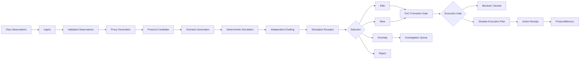

# LoPAS Protocol Foundry

LoPAS Protocol Foundry is an **experimental protocol discovery, evaluation, promotion, and Shadow-compilation system** for turning fragmented observations into traceable workflow candidates.

It explores the layer **before automation**:

```text
Observation
→ Ingest
→ Proxy
→ Protocol Candidate
→ Simulation and Independent Grading
→ Selection
→ PoC Promotion
→ Shadow Execution Plan
→ Action Receipt
→ ProtocolMemory
```

Raw observations are materials, not instructions.

A complaint, meeting note, workaround, idea, failure report, or repeated friction point is not treated as an executable workflow. The Foundry first translates source material into explicit, inspectable contracts with provenance, conditions, routes, failure behavior, authority boundaries, and promotion requirements.

> **Project status: experimental local runtime.**
>
> The repository currently contains a Python reference runtime and a C++20 reference port.
>
> The Python runtime implements the broader v0.1 Foundry pipeline through the no-side-effect Shadow boundary.
>
> The C++20 runtime currently focuses on typed deterministic evaluation, conservative gating, promotion, and Shadow receipt generation. It is not yet a full behavioral replacement for the Python runtime.

---

## Core Idea

Most automation systems begin after a workflow has already been defined:

```text
Human-defined workflow
→ AI / RPA / software
→ execution
```

LoPAS Protocol Foundry explores the translation layer before that:

```text
Fragmented observations
→ reusable structure
→ explicit protocol candidate
→ scenario-based evaluation
→ evidence-aware gate
→ controlled runtime
```

The important artifact is not the implementation language.

The important artifact is the **protocol contract and its invariants**.

```text
                 ┌→ Python runtime
Observation      │
→ Protocol ──────┼→ C++20 runtime
                 │
                 ├→ RPA / Adapter
                 │
                 └→ future Agent runtime
```

Different runtimes may implement the same protocol boundary, provided that critical behavior is preserved and verified.

This makes the Foundry a translation layer between:

```text
human observations
        ↓
structured evidence
        ↓
protocol
        ↓
deterministic gate
        ↓
runtime
        ↓
receipt
```

---

## Why This Exists

The goal is not to ask an LLM for one “best workflow.”

The goal is to build an inspectable pipeline that can:

- preserve source evidence separately from interpretation;
- normalize repeated friction into reusable Proxies;
- turn vague observations into explicit Protocol Candidates;
- keep required inputs, conditions, routes, and authority visible;
- test candidates under nominal, boundary, adversarial, and failure conditions;
- compare expected behavior with simulated actual behavior;
- preserve strong, unusual, anomalous, and rejected candidates;
- stop safely when evidence, authority, approval, or bindings are incomplete;
- promote only qualified candidates toward controlled testing;
- record meaningful transformations and decisions as receipts;
- allow multiple runtime implementations without silently changing protocol meaning.

Simulation is not proof of real-world effectiveness.

A generated protocol remains a candidate until it passes explicit promotion gates.

---

# Runtime Implementations

## Python Reference Runtime

The Python runtime is the broader reference implementation of the current Foundry pipeline.

It currently includes:

- YAML/JSON/JSONL observation ingestion;
- schema validation;
- Proxy generation;
- Protocol Candidate generation;
- synthetic Scenario generation;
- deterministic Simulation;
- Independent Grading;
- Selection;
- evidence-aware PoC Routing;
- Promotion-to-Shadow gating;
- Adapter Binding validation;
- Shadow Execution Plans;
- Action Receipts;
- integrated local execution;
- regression tests.

Run the full local Python pipeline with:

```bash
python -m src.foundry \
  <observation-input.yaml> \
  --output-dir receipts/full_run \
  --scenario-count 30 \
  --current-level 2 \
  --next-level 3
```

---

## C++20 Reference Port

`cpp/` contains a buildable C++20 reference implementation of the deterministic Foundry core.

The goal of the C++ port is **not** to claim that C++ is inherently better than Python.

It exists to test whether the Foundry's important invariants can survive translation into a different runtime.

The current C++20 implementation includes:

- typed domain models;
- `enum class` routes and verdicts;
- `std::variant` condition values;
- `std::optional` unknown/evidence states;
- deterministic expression evaluation;
- conservative route precedence;
- Scenario simulation;
- Independent Grading;
- Selection;
- evidence-aware Promotion;
- Shadow Action Receipt generation;
- JSON input/output;
- CMake build;
- native tests;
- sanitizer support;
- Linux CI support.

The C++ runtime currently uses:

```text
C++20
CMake 3.20+
json-c
```

### Important compatibility note

The C++20 runtime is currently a **reference port**, not a full replacement for the Python runtime.

It does not yet claim complete parity for:

- YAML handling;
- every existing JSON/YAML schema;
- all task-specific Proxy rules;
- all Protocol templates;
- every Scenario generator;
- cross-candidate diversity behavior;
- Python-vs-C++ golden-output parity.

See:

```text
cpp/COMPATIBILITY.md
cpp/VALIDATION.md
```

before treating the C++ runtime as behaviorally equivalent to the Python implementation.

---

# Safety Invariants

Regardless of implementation language, the intended Foundry behavior is conservative.

## Route precedence

```text
DENY > ESCALATE > HOLD > REVIEW > AUTO
```

A less restrictive route must never override a more restrictive applicable route.

## Unknown means HOLD

Unsupported or unresolved conditions do not silently become permission.

```text
known safe      → continue evaluation
unknown         → HOLD
unsupported     → HOLD
explicit denial → DENY
```

## Candidates are not authority

Generated Protocol Candidates begin unconfirmed.

```yaml
intent:
  status: unconfirmed
```

Generation does not authorize execution.

## Missing evidence blocks promotion

Strong Simulation performance alone is insufficient.

Required evidence may include:

- source diversity;
- authority scope;
- monitoring;
- rollback or containment;
- human approval;
- execution bindings.

Missing required evidence keeps the candidate on `HOLD`.

## Shadow means no external effect

Even when a candidate reaches `READY`, Shadow mode does not execute the external action.

Expected Shadow behavior:

```text
route: READY
status: shadowed
external_effects: []
```

The Shadow boundary exists to prove that a candidate **could be compiled into an execution plan**, not that an external action actually occurred.

---

# Core Pipeline



The current executable local path reaches the Shadow boundary.

Shadow mode describes and records what would execute but does not call external tools, APIs, humans, adapters, or services.

---

# Current Scope

## Implemented and inspectable

### Shared architecture

- Observation → Proxy → Protocol Candidate pipeline;
- deterministic safety-oriented routing;
- Simulation and Independent Grading;
- Selection archives;
- evidence-aware promotion;
- conservative execution boundaries;
- receipts and provenance;
- Shadow-mode zero-external-effect behavior.

### Python runtime

- versioned YAML schemas;
- JSON/YAML/JSONL input;
- stage-local CLIs;
- integrated local runner;
- synthetic Scenario generation;
- Independent Grading;
- Selection archives:
  - `elite`
  - `rare`
  - `anomaly`
  - `reject`
- PoC Promotion;
- Adapter Binding validation;
- Shadow Execution Plans;
- Action Receipts;
- synthetic Level 3 READY fixture;
- regression tests.

### C++20 runtime

- typed Foundry models;
- deterministic condition evaluator;
- route precedence;
- Simulation;
- Independent Grading;
- Selection;
- Promotion;
- Shadow receipt generation;
- JSON boundary;
- CMake build;
- native test executable;
- optional ASan/UBSan;
- CI-ready build structure.

---

## Not implemented as production capability

This repository does **not** currently provide:

- autonomous external execution;
- production Adapter invocation;
- production source integrations;
- a hosted stable API;
- a stable SDK;
- production authentication or authorization;
- production secrets management;
- multi-tenant isolation;
- a production human-review console;
- complete real-world historical replay infrastructure;
- automatic ProtocolMemory learning;
- guarantees that Simulation predicts real-world outcomes;
- guaranteed Python/C++ behavioral parity.

Interfaces, filenames, schemas, thresholds, and runtime behavior may still change.

---

# Quick Start

## Python

### Requirements

- Python 3.11+
- PyYAML
- jsonschema with format support

Install:

```bash
python -m pip install -e .
```

Run tests:

```bash
python -m unittest \
  tests.test_execution_gate \
  tests.test_execution_pipeline \
  tests.test_foundry_pipeline -v
```

Run the integrated Foundry:

```bash
python -m src.foundry \
  <observation-input.yaml> \
  --output-dir receipts/full_run \
  --scenario-count 30 \
  --current-level 2 \
  --next-level 3
```

---

## C++20

### Requirements

- CMake 3.20+
- C++20 compiler
- `json-c`

GCC 12+ or Clang 15+ is recommended.

Ubuntu / Debian:

```bash
sudo apt-get install -y \
  build-essential \
  cmake \
  libjson-c-dev
```

### Build from repository root

```bash
cmake \
  -S cpp \
  -B cpp/build \
  -DCMAKE_BUILD_TYPE=Release

cmake --build cpp/build --parallel
```

Run tests:

```bash
ctest \
  --test-dir cpp/build \
  --output-on-failure
```

Optional sanitizer build:

```bash
cmake \
  -S cpp \
  -B cpp/build-sanitize \
  -DLOPAS_ENABLE_SANITIZERS=ON

cmake --build cpp/build-sanitize --parallel

ctest \
  --test-dir cpp/build-sanitize \
  --output-on-failure
```

---

# C++20 Examples

## Conservative default

Run without confirming candidate intent and without promotion evidence:

```bash
./cpp/build/lopas_foundry \
  cpp/examples/observations.json \
  --output-dir cpp/receipts/default \
  --scenario-count 20
```

The expected behavior is conservative.

Missing confirmation or required evidence should prevent unsafe promotion.

---

## Confirmed candidate with evidence

```bash
./cpp/build/lopas_foundry \
  cpp/examples/observations.json \
  --output-dir cpp/receipts/confirmed \
  --scenario-count 20 \
  --confirm-intent \
  --evidence cpp/examples/evidence.json \
  --current-level 2 \
  --next-level 3
```

---

## Optional Shadow boundary

```bash
./cpp/build/lopas_foundry \
  cpp/examples/observations.json \
  --output-dir cpp/receipts/shadow \
  --scenario-count 20 \
  --confirm-intent \
  --evidence cpp/examples/evidence.json \
  --current-level 2 \
  --next-level 3 \
  --shadow-bindings cpp/examples/adapter_bindings.json
```

A successful Shadow compilation must still report no real-world effects.

```json
{
  "status": "shadowed",
  "external_effects": []
}
```

---

# Python Integrated Local Runtime

Run every implemented Python Foundry stage in one receipt-preserving process:

```bash
python -m src.foundry \
  <observation-input.yaml> \
  --output-dir receipts/full_run \
  --scenario-count 30 \
  --current-level 2 \
  --next-level 3
```

Add the optional Shadow boundary:

```bash
python -m src.foundry \
  <observation-input.yaml> \
  --output-dir receipts/full_run \
  --scenario-count 30 \
  --current-level 2 \
  --next-level 3 \
  --shadow-bindings examples/full_run/adapter_bindings.yaml \
  --execution-inputs examples/full_run/execution_inputs.yaml
```

Without `--shadow-bindings`, the integrated run stops after PoC Promotion.

A completed run may legitimately end with:

```text
HOLD
REVISE
REJECT
DENY
```

A Shadow Plan may similarly be blocked or denied.

These are valid governance results, not runtime crashes.

---

# Shadow Execution Boundary

The Python execution stage can also be rerun independently against existing candidates and promotions:

```bash
python -m src.execution \
  receipts/full_run/03_protocol_candidates.yaml \
  receipts/full_run/06_poc_promotions.yaml \
  examples/full_run/adapter_bindings.yaml \
  --inputs examples/full_run/execution_inputs.yaml \
  --output-dir receipts/full_run
```

The execution gate independently verifies that:

- the Promotion references the same Protocol Candidate;
- candidate intent is explicitly confirmed;
- the promotion decision is `PROMOTE`;
- promotion eligibility is true;
- all declared checks are true;
- the requested next level is at least Level 3;
- blocking conditions are resolved or waived;
- no required approval is pending or rejected;
- authority scope is known;
- required execution inputs are present;
- every action has an enabled Adapter Binding;
- no step action is explicitly forbidden.

Missing or unknown information becomes `HOLD`.

Explicit rejection, denial, or rejected approval becomes `DENY`.

Even when the gate returns `READY`, Shadow mode:

- does not invoke the Adapter;
- does not perform external actions;
- records every step as having no external effect;
- emits `external_effects: []`;
- writes an Action Receipt with status `shadowed`.

---

# Immediate READY Fixture

The Python runtime includes a synthetic fixture that verifies the Promotion-to-Shadow boundary independently of upstream generation:

```bash
python -m src.execution \
  examples/full_run/shadow_ready_candidates.yaml \
  examples/full_run/shadow_ready_promotions.yaml \
  examples/full_run/adapter_bindings.yaml \
  --inputs examples/full_run/execution_inputs.yaml \
  --output-dir receipts/shadow_ready \
  --require-ready
```

Expected result:

```text
route: READY
status: shadowed
external_effects: []
```

This fixture is validation material.

It is not production evidence.

---

# Stage Responsibilities

## 1. Observation and Ingest

An Observation is a source-grounded record of something that:

- happened;
- failed;
- repeated;
- was proposed;
- was avoided;
- remained unresolved.

The Python Ingest stage accepts:

```text
.jsonl
.ndjson
.json
.yaml
.yml
```

Each record is validated against:

```text
schemas/observation.schema.yaml
```

Invalid records are never silently mixed into validated output.

Example:

```bash
python -m src.ingest \
  <observation-input.jsonl> \
  --output receipts/observations.yaml
```

An Observation is evidence-bearing input.

It is not yet a recommendation or executable protocol.

---

## 2. Proxy

A Proxy is a normalized intermediate representation that separates reusable structure from source wording.

The deterministic baseline records information such as:

- task type;
- friction;
- affected actors;
- expected effects;
- evidence density;
- confidence;
- external impact;
- reversibility;
- uncertainty;
- constraints;
- risk hints;
- provenance.

Example:

```bash
python -m src.proxy \
  receipts/observations.yaml \
  --output receipts/proxies.yaml
```

Interpretation remains labeled as interpretation.

---

## 3. Protocol Candidate

The Protocol stage groups validated Proxies into explicit candidate workflows.

A Protocol Candidate may define:

- triggers;
- trigger conditions;
- required inputs;
- optional inputs;
- preconditions;
- ordered steps;
- executors;
- routing rules;
- route precedence;
- stop conditions;
- human-review boundaries;
- forbidden actions;
- failure handling;
- outputs;
- provenance;
- activation requirements.

Example:

```bash
python -m src.protocol \
  receipts/proxies.yaml \
  --output receipts/protocol_candidates.yaml
```

Generated candidates begin unconfirmed.

```yaml
intent:
  status: unconfirmed
```

A candidate's default route must never be interpreted as live-execution authority.

---

## 4. Scenario Generation

The Foundry creates synthetic situations designed to exercise the candidate contract.

Applicable scenarios may include:

- nominal behavior;
- missing inputs;
- unknown inputs;
- false conditions;
- unsupported conditions;
- human-review boundaries;
- conflicting routes;
- stop conditions;
- known failures;
- forbidden actions;
- stale context;
- under-escalation;
- overblocking.

---

## 5. Deterministic Simulation

Simulation evaluates the declared protocol without performing external actions.

Route precedence is conservative:

```text
DENY > ESCALATE > HOLD > REVIEW > AUTO
```

Unsupported expressions route to `HOLD`.

They are recorded rather than silently ignored.

---

## 6. Independent Grading

The Independent Grader compares:

```text
candidate contract
+
predeclared expectation
+
simulated behavior
+
safety invariants
```

The Grader does not activate the candidate.

Generation and grading remain separate roles.

---

## 7. Selection

Selection aggregates Simulation Receipts while keeping different signals separate.

| Archive | Purpose |
|---|---|
| `elite` | Strong aggregate performance with sufficient coverage |
| `rare` | Coherent behavior materially distant from existing candidates |
| `anomaly` | Scenario-specific or unsupported behavior requiring study |
| `reject` | Unsafe, invalid, unsupported, or critically divergent behavior |

`reject` is exclusive and takes precedence.

A candidate may be both:

```text
elite
+
rare
```

when appropriate.

The goal is not only ranking.

The Foundry also preserves useful diversity and anomalies.

---

## 8. PoC Promotion and Routing

Promotion combines:

- validated Protocol Candidates;
- Selection Results;
- optional real-world Evidence Manifests.

Performance alone is not enough.

The Promotion gate may recheck:

- archive membership;
- observation count;
- verified source diversity;
- simulation count;
- acceptable Simulation rate;
- critical divergences;
- authority scope;
- monitoring;
- rollback;
- containment;
- human approval.

Without evidence for required gates:

```text
HOLD
```

is the intended result.

---

## 9. Shadow Execution

The Shadow stage compiles eligible Protocol Candidates into inspectable execution plans.

It validates registered action-to-Adapter bindings.

It does **not** invoke the Adapter.

The purpose of Shadow is to determine whether the current candidate can safely cross the present execution boundary and to record why.

---

# Promotion Ladder

Simulation is not proof.

| Level | Stage |
|---:|---|
| 0 | Schema and contradiction checks |
| 1 | Synthetic Scenario Simulation |
| 2 | Historical-log replay |
| 3 | Shadow mode |
| 4 | Limited and reversible PoC |
| 5 | Monitored operation |

The current integrated execution boundary supports Level 3 Shadow compilation.

Levels 4 and 5 require additional infrastructure such as:

- live Adapters;
- accountable operators;
- monitoring;
- rollback;
- containment;
- authorization;
- production controls.

---

# Generated Artifacts

## Python integrated run

A Python integrated run may write:

```text
00_run_manifest.yaml

01_observations.yaml
01_ingest_receipt.yaml

02_proxies.yaml
02_proxy_receipt.yaml

03_protocol_candidates.yaml
03_protocol_receipt.yaml

04_simulation_receipts.yaml
04_simulation_stage_receipt.yaml

05_selection_results.yaml
05_selection_stage_receipt.yaml

06_poc_promotions.yaml
06_routing_stage_receipt.yaml

07_execution_plans.yaml
07_action_receipts.yaml
07_execution_stage_receipt.yaml
```

The execution artifacts are produced only when the Shadow boundary is requested.

---

## C++20 run

The current C++ reference runtime writes JSON artifacts:

```text
01_observations.json
02_proxies.json
03_protocol_candidates.json
04_simulation_receipts.json
05_selection_results.json
06_poc_promotions.json
07_action_receipts.json
```

`07_action_receipts.json` is emitted only when Shadow bindings are supplied.

---

# Repository Structure

```text
lopas-protocol-foundry/
├─ README.md
├─ LICENSE
├─ pyproject.toml
│
├─ .github/
│  └─ workflows/
│     └─ cpp.yml
│
├─ schemas/
│  ├─ observation.schema.yaml
│  ├─ proxy.schema.yaml
│  ├─ protocol_candidate.schema.yaml
│  ├─ simulation_receipt.schema.yaml
│  ├─ poc_promotion.schema.yaml
│  ├─ adapter_manifest.schema.yaml
│  ├─ execution_plan.schema.yaml
│  └─ action_receipt.schema.yaml
│
├─ src/
│  ├─ ingest/
│  ├─ proxy/
│  ├─ protocol/
│  ├─ simulation/
│  ├─ selection/
│  ├─ routing/
│  ├─ foundry/
│  └─ execution/
│
├─ cpp/
│  ├─ CMakeLists.txt
│  ├─ README.md
│  ├─ COMPATIBILITY.md
│  ├─ VALIDATION.md
│  │
│  ├─ include/
│  │  └─ lopas/
│  │     ├─ types.hpp
│  │     ├─ expression.hpp
│  │     ├─ foundry.hpp
│  │     └─ io.hpp
│  │
│  ├─ src/
│  │  ├─ types.cpp
│  │  ├─ expression.cpp
│  │  ├─ foundry.cpp
│  │  ├─ io.cpp
│  │  └─ main.cpp
│  │
│  ├─ tests/
│  │  └─ test_main.cpp
│  │
│  ├─ examples/
│  │  ├─ observations.json
│  │  ├─ evidence.json
│  │  └─ adapter_bindings.json
│  │
│  └─ validation/
│     ├─ default_promotion.json
│     ├─ promoted_with_evidence.json
│     └─ shadow_action_receipt.json
│
├─ prompts/
│  ├─ proxy_generation.md
│  ├─ protocol_generation.md
│  ├─ scenario_generation.md
│  └─ independent_grader.md
│
├─ examples/
│  ├─ sample_run/
│  └─ full_run/
│
├─ docs/
│  └─ local-runtime.md
│
├─ receipts/
│
└─ tests/
   ├─ test_foundry_pipeline.py
   ├─ test_execution_gate.py
   └─ test_execution_pipeline.py
```

The `.github/` directory belongs at the repository root.

It should not be placed under `cpp/`.

---

# Protocol vs Runtime

The Foundry increasingly treats these as separate concepts.

## Protocol layer

The Protocol layer describes:

- what was observed;
- what is inferred;
- what inputs are required;
- what conditions apply;
- what routes exist;
- which route has precedence;
- what is forbidden;
- when a human is required;
- what counts as failure;
- what evidence is required for promotion.

This is intended to remain independent from a specific implementation language.

---

## Runtime layer

A runtime implements the contract.

Current examples:

```text
Python 3.11+
C++20
```

Future runtimes may include:

```text
JavaScript / TypeScript
RPA
local Agent runtime
embedded systems
service adapters
```

Adding another runtime should not silently change the protocol's safety invariants.

---

# Behavioral Parity

The long-term goal is not source-code similarity.

The goal is **behavioral parity**.

For example:

```text
same Protocol Candidate
        ↓
   ┌────┴────┐
   ↓         ↓
Python     C++20
   ↓         ↓
Receipt   Receipt
   └────┬────┘
        ↓
meaningful invariants match
```

Important invariants may include:

- route;
- rejection behavior;
- unknown handling;
- safety failures;
- promotion eligibility;
- Shadow status;
- external-effect declarations.

A future shared Golden Test suite should verify these invariants across runtimes.

Until that suite exists and passes, the repository should not claim full Python/C++ parity.

---

# Examples

## `examples/sample_run/`

A manually inspectable synthetic trace:

```text
Observation
→ Proxy
→ Protocol Candidate
→ Scenario Suite
→ Simulation Record
→ Independent Grade
→ Simulation Receipt
```

The purpose is not to prove that a real workflow is safe or unsafe.

The purpose is to show that the Foundry can:

- preserve provenance;
- expose a missing guard;
- preserve disagreement;
- attribute divergence;
- emit an inspectable receipt.

---

## `examples/full_run/`

Fixtures for:

- integrated local execution;
- independent Shadow reruns;
- synthetic confirmed candidates;
- Level 3 promotion;
- READY validation;
- zero-external-effect Shadow behavior.

---

## `cpp/examples/`

Minimal JSON material for the C++20 reference runtime:

```text
observations.json
evidence.json
adapter_bindings.json
```

These examples exercise the typed deterministic runtime without claiming full Python fixture parity.

---

# Prompt Contracts

The prompt files remain stage-local specifications.

| Prompt | Input | Output |
|---|---|---|
| `proxy_generation.md` | validated Observation material | Proxy document |
| `protocol_generation.md` | validated Proxy material | Protocol Candidate |
| `scenario_generation.md` | validated Protocol Candidate | Scenario Suite |
| `independent_grader.md` | candidate, expectation, simulated behavior | Independent Grade |

Prompts are intended to:

- constrain the model's role;
- define allowed inputs;
- define required outputs;
- preserve provenance;
- preserve uncertainty;
- prohibit unsupported execution claims;
- emit schema-oriented structured data;
- keep deterministic validation outside the model where possible.

The runtime does not treat an LLM as execution authority.

---

# Design Principles

## Evidence before interpretation

Source evidence and model interpretation must remain distinguishable.

---

## Candidates before execution

Generated protocols begin as candidates.

Activation requires explicit confirmation and promotion.

---

## Receipts everywhere

Meaningful transformations should record information such as:

- input references;
- schema version;
- rule version;
- prompt version;
- model version;
- runtime version;
- pipeline version;
- output identifiers;
- validation results;
- failures;
- divergences;
- routing decisions;
- timestamps;
- promotion state;
- execution-boundary decisions.

---

## Deterministic boundaries

LLMs may propose structure.

Deterministic systems should own, whenever practical:

- schema validation;
- route precedence;
- safety gates;
- promotion thresholds;
- binding checks;
- explicit authority boundaries.

---

## Independent expectations

Scenario expectations should not simply copy the candidate's default route.

Independent expectations are needed to expose missing guards.

---

## Diversity, not only ranking

The Foundry preserves unusual but coherent candidates instead of optimizing only for average performance.

---

## Reversible first

Early PoCs should prefer operations that are:

- bounded;
- observable;
- reversible;
- low-impact.

---

## Unknown means HOLD

Missing evidence and unresolved contradictions should produce conservative routing rather than silent automation.

---

## A blocked run is still a result

A conservative system proves its value partly by refusing to cross a boundary without sufficient:

- evidence;
- authority;
- approval;
- inputs;
- monitoring;
- rollback;
- bindings.

---

## Implementation language is not authority

Changing:

```text
Python → C++
```

must not automatically change:

```text
HOLD → AUTO
```

or:

```text
DENY → READY
```

Runtime translation must preserve protocol meaning.

---

# Safety Boundaries

A candidate should not be promoted or compiled into a Shadow Plan when:

- provenance is missing or fabricated;
- evidence and interpretation cannot be separated;
- candidate intent is unconfirmed;
- required inputs are unknown;
- authority is unknown;
- the requested route exceeds authority;
- external impact is high and reversibility is low;
- required human review is absent;
- human review is bypassed;
- policy ambiguity is unresolved;
- privacy ambiguity is unresolved;
- legal ambiguity is unresolved;
- rights or ownership are unresolved;
- Simulation coverage is inadequate;
- critical divergences remain unresolved;
- monitoring is missing;
- rollback is missing;
- approvals are pending;
- approvals are rejected;
- failures may remain silent;
- the candidate depends on invented facts;
- Adapter Binding is absent;
- Adapter Binding is disabled;
- a success-looking output is stale, incomplete, or unsafe.

The intended behavior is conservative:

```text
unconfirmed            → HOLD
confirmed + qualified  → eligible for controlled promotion
rejected               → DENY / REJECT
insufficient evidence  → HOLD
missing binding        → HOLD
rejected approval      → DENY
```

---

# What This Project Is Not

LoPAS Protocol Foundry is not:

- proof that LLM Simulation predicts real-world success;
- a finished autonomous business-process executor;
- a production scraping system;
- a replacement for domain experts;
- a replacement for accountable owners;
- a way to bypass human consent;
- a way to bypass policy;
- a way to bypass authorization;
- a universal optimizer;
- a live external-action runtime;
- a stable hosted service;
- a frozen SDK;
- proof that the Python and C++ implementations are already identical.

It is an experimental:

```text
Observation
→ Translation
→ Protocol
→ Evaluation
→ Gate
→ Shadow Compilation
→ Receipt
```

system.

---

# Data and Provenance

Recommended practice:

- store references instead of unnecessary raw content;
- minimize personal data;
- minimize confidential data;
- preserve source identifiers;
- preserve timestamps;
- distinguish quotation from summary;
- distinguish summary from interpretation;
- distinguish interpretation from inference;
- record model versions;
- record rule versions;
- record schema versions;
- record prompt versions;
- record pipeline versions;
- record runtime implementation versions;
- maintain deletion paths;
- maintain exclusion paths;
- maintain authority-withdrawal paths;
- never invent source references;
- never invent historical outcomes;
- avoid promotion based on one weak observation;
- label synthetic fixtures clearly;
- keep Action Receipts separate from claims of real-world execution.

Future source adapters should emit the common Observation contract so downstream stages remain independent from the original platform.

---

# Validation

## Python

The Python integrated runtime includes deterministic tests covering behavior such as:

- conservative execution-gate behavior;
- missing bindings;
- missing required inputs;
- rejected approvals;
- rejected promotion decisions;
- Level 3 READY compilation;
- zero-external-effect Shadow output;
- duplicate promotion rejection;
- ordered Foundry-stage composition;
- optional Shadow execution inside the integrated run.

These tests validate software behavior.

They do not prove real-world effectiveness.

---

## C++20

The C++ runtime contains native tests under:

```text
cpp/tests/
```

Build and run:

```bash
cmake -S cpp -B cpp/build
cmake --build cpp/build --parallel
ctest --test-dir cpp/build --output-on-failure
```

Validation fixtures are stored under:

```text
cpp/validation/
```

Current C++ validation focuses on:

- conservative default promotion;
- promotion with explicit evidence;
- Shadow receipt behavior;
- deterministic route handling.

See:

```text
cpp/VALIDATION.md
```

for the current validation boundary.

---

# Roadmap

## v0.1 — Local Foundry and Shadow Boundary

- [x] Core YAML schemas
- [x] Deterministic Ingest
- [x] Deterministic Proxy
- [x] Deterministic Protocol Candidate generation
- [x] Synthetic Scenario generation
- [x] Deterministic Simulation
- [x] Independent Grading
- [x] Selection archives
- [x] Evidence-aware PoC Routing
- [x] Stage-local Python CLIs
- [x] Integrated Python Foundry runner
- [x] Shadow Execution Plans
- [x] Action Receipts with zero external effects
- [x] Sample trace
- [x] Synthetic Level 3 READY fixture
- [x] Python integrated tests
- [x] Initial C++20 deterministic runtime port
- [x] C++ CMake build
- [x] C++ native tests
- [x] C++ JSON boundary
- [ ] Broader cross-schema fixture coverage
- [ ] Complete architecture documentation
- [ ] Additional domain-specific examples

---

## v0.2 — Runtime Parity, Replay, and Comparison

- [ ] Shared Python/C++ Golden Test fixtures
- [ ] Behavioral parity reports
- [ ] YAML support in C++ runtime
- [ ] Broader schema parity
- [ ] Historical-log replay adapters
- [ ] Candidate mutation
- [ ] Expanded behavioral-distance metrics
- [ ] Protocol comparison
- [ ] Divergence reports
- [ ] prompt/rule/model/runtime version comparison
- [ ] repeated-run evidence aggregation

---

## v0.3 — Controlled Adapters

- [ ] Generic local-file Adapter
- [ ] Human-review queue
- [ ] Meeting-log Adapter
- [ ] Support-log Adapter
- [ ] Reversible live-action contract
- [ ] rollback interfaces
- [ ] containment interfaces
- [ ] operator approval console

---

## Later Exploration

- distributed observation sources;
- Quality-Diversity search;
- multi-model Simulation;
- domain-specific Graders;
- Protocol registries;
- ProtocolMemory feedback loops;
- controlled Action Adapter integration;
- additional runtime implementations;
- monitored Level 4 operation;
- monitored Level 5 operation.

---

# Contributing

This repository is experimental and safety-oriented.

Useful contributions include:

- schema review;
- valid fixtures;
- invalid fixtures;
- adversarial scenarios;
- deterministic validators;
- provenance tooling;
- Simulation tests;
- Grader tests;
- behavioral-distance metrics;
- small reproducible domain examples;
- safety-gate tests;
- Promotion tests;
- Shadow-boundary tests;
- Python/C++ Golden Test fixtures;
- runtime parity tooling;
- documentation that clearly distinguishes implemented behavior from planned behavior.

Keep examples inspectable.

Do not commit sensitive, confidential, or personally identifiable data.

---

# License

See `LICENSE` for the current terms.

Do not assume permissions beyond the contents of that file.

---

# One-Sentence Summary

**LoPAS Protocol Foundry translates fragmented observations into traceable Protocol Candidates, tests them through deterministic and evidence-aware gates, and allows qualified protocols to be compiled into conservative runtimes and no-side-effect Shadow Receipts without tying the protocol itself to one implementation language.**
