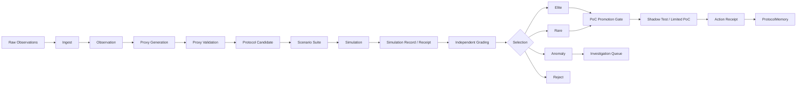

# LoPAS Protocol Foundry

LoPAS Protocol Foundry is an **experimental, incomplete reference implementation** for turning fragmented observations into traceable protocol candidates, testing them against explicit scenarios, and deciding whether they are safe and useful enough to enter a controlled proof of concept.

```text
Observation
→ Proxy
→ Protocol Candidate
→ Scenario Suite
→ Simulation
→ Independent Grading
→ Selection
→ PoC Promotion
→ Receipt
→ ProtocolMemory
```

Raw observations are materials, not instructions.

The Foundry does not treat a post, complaint, meeting note, idea, or workaround as an executable workflow. It first converts the source material into an inspectable candidate with explicit inputs, conditions, routes, safety boundaries, provenance, and failure behavior.

> **Project status:** v0.1 design-first prototype.  
> The schemas, prompt contracts, and one sample trace are the most developed parts. The repository is **not yet a complete end-to-end runtime**, stable CLI, production service, or autonomous executor.

---

## Why This Exists

Most AI automation begins after a workflow has already been defined:

```text
Human-defined workflow
→ AI agent
→ execution
```

LoPAS Protocol Foundry explores the layer before that:

```text
Distributed observations
→ reusable structure
→ candidate workflows
→ scenario-based evaluation
→ limited and reversible PoC
```

The goal is not to ask an LLM for one “best idea.” The goal is to build a pipeline that can eventually:

- preserve source evidence separately from interpretation;
- normalize repeated friction into reusable proxies;
- generate explicit protocol candidates rather than hidden instructions;
- test candidates under normal, boundary, adversarial, and failure conditions;
- compare expected behavior with simulated behavior;
- preserve strong, unusual, anomalous, and rejected candidates;
- promote only qualified candidates toward controlled real-world testing;
- record transformations and decisions as receipts.

Simulation is not proof of real-world effectiveness. A generated protocol remains a candidate until it passes explicit promotion gates.

---

## Current Scope

### Present and inspectable

- versioned YAML schemas for the major stage boundaries;
- prompt specifications for Proxy Generation, Protocol Generation, Scenario Generation, and Independent Grading;
- one manually inspectable end-to-end sample trace;
- early implementation and module scaffolding under `src/`.

### Incomplete or still changing

- a stable command-line interface;
- complete executable coverage for every stage;
- cross-schema and regression tests;
- domain-specific example suites;
- historical replay and shadow-mode execution;
- production source adapters;
- complete Selection and Routing workflows;
- full architecture, safety, and PoC lifecycle documentation;
- production integrations and autonomous external execution.

Interfaces, filenames, and runtime behavior may change during v0.1. The schemas and receipts are intended to become the stable boundaries, but they should not yet be treated as frozen public APIs.

---

## Core Pipeline



This diagram describes the intended architecture. Not every arrow is currently implemented as an executable stage.

---

## Stage Responsibilities

### Observation

A source-grounded record of something that happened, was proposed, failed, repeated, was avoided, or remained unresolved.

Possible sources include public posts, GitHub issues, meeting notes, support logs, incident reports, operator notes, and manually entered cases.

An Observation is evidence-bearing input. It is not yet a recommendation or protocol.

### Proxy

A normalized intermediate representation that separates reusable structure from the source wording.

A Proxy may describe:

- task type;
- friction;
- affected actor;
- expected effect;
- evidence density;
- external impact;
- reversibility;
- uncertainty;
- generalizability;
- provenance references.

The Proxy is the translation layer between raw observations and protocol design.

### Protocol Candidate

A proposed reusable procedure with explicit:

- triggers and trigger conditions;
- required and optional inputs;
- preconditions;
- ordered steps and executors;
- routing rules and precedence;
- stop conditions;
- human-review boundaries;
- forbidden actions;
- failure handling;
- outputs;
- provenance;
- activation requirements.

A generated candidate is not automatically active.

### Scenario Suite

A set of test propositions declared before simulation.

Scenarios may cover:

- nominal behavior;
- missing or unknown inputs;
- boundary values;
- conflicting routing rules;
- forbidden actions;
- authority withdrawal;
- privacy and ownership boundaries;
- stale context;
- silent factual or completion failures;
- under-escalation and overblocking;
- adversarial instruction attempts.

A scenario defines expected behavior. It does not fabricate the Simulator’s actual result.

### Simulation

The Simulator applies a Protocol Candidate to a declared scenario and records actual behavior.

The output should be structured and inspectable rather than a free-form opinion. Simulation may reveal implementation mismatch, candidate defects, missing guards, or insufficient evidence.

### Independent Grading

The Independent Grader compares:

- the candidate contract;
- the scenario’s predeclared expectation;
- the Simulator’s actual output;
- safety invariants and permitted evidence.

Its role is to separate likely causes of failure, including:

- Protocol Candidate defect;
- Simulator defect;
- Scenario defect;
- missing safety guard;
- insufficient evidence;
- ambiguous or unsupported evaluation.

The grader does not activate a candidate or perform external execution.

### Selection

The intended Selection stage does not preserve only one overall winner.

| Archive | Purpose |
|---|---|
| `elite` | Strong overall performance |
| `rare` | Coherent behavior that differs materially from existing candidates |
| `anomaly` | Unusually strong, weak, or inconsistent behavior under specific conditions |
| `reject` | Unsafe, invalid, unsupported, or consistently ineffective |

This is intended to prevent conventional candidates from crowding out unusual designs that may be useful in narrow environments.

### PoC Promotion

Simulation is not proof.

The planned promotion ladder is:

| Level | Stage |
|---:|---|
| 0 | Schema and contradiction checks |
| 1 | Synthetic scenario simulation |
| 2 | Historical-log replay |
| 3 | Shadow mode |
| 4 | Limited and reversible PoC |
| 5 | Monitored operation |

Promotion decisions are represented by `poc_promotion` documents. The full promotion runtime is not yet complete.

---

## Repository Structure

```text
lopas-protocol-foundry/
├─ README.md
├─ LICENSE
├─ schemas/
│  ├─ observation.schema.yaml
│  ├─ proxy.schema.yaml
│  ├─ protocol_candidate.schema.yaml
│  ├─ simulation_receipt.schema.yaml
│  └─ poc_promotion.schema.yaml
│
├─ src/
│  ├─ ingest/
│  ├─ proxy/
│  ├─ protocol/
│  ├─ simulation/
│  ├─ selection/
│  └─ routing/
│
├─ prompts/
│  ├─ proxy_generation.md
│  ├─ protocol_generation.md
│  ├─ scenario_generation.md
│  └─ independent_grader.md
│
├─ examples/
│  └─ sample_run/
│
├─ receipts/
├─ tests/
└─ docs/
   ├─ architecture.md
   ├─ safety-model.md
   └─ poc-lifecycle.md
```

### Directory status

| Path | Role | v0.1 status |
|---|---|---|
| `schemas/` | Contracts between pipeline stages | Present; still subject to revision |
| `prompts/` | LLM generation and grading specifications | Present |
| `examples/sample_run/` | One inspectable end-to-end trace | Present |
| `src/` | Local runtime modules | Partial and uneven by stage |
| `receipts/` | Generated or archived run artifacts | Incomplete |
| `tests/` | Schema, regression, parity, and safety tests | Not yet complete |
| `docs/` | Architecture, safety, and lifecycle documentation | Planned or incomplete |
| domain examples | Meeting, support, and observation-specific cases | Not yet complete |

---

## Sample Run

See:

```text
examples/sample_run/
```

The sample is intended to demonstrate how identifiers, provenance, expectations, simulated actuals, grading, and receipts connect across stages.

It is a reference trace, not evidence that:

- the candidate works in production;
- LLM simulation predicts real-world outcomes;
- the complete runtime is implemented;
- the protocol is authorized for activation;
- the current schemas are final.

A useful sample run should make disagreement visible. For example, the Simulator may follow a candidate’s declared default route while the Independent Grader identifies a missing freshness, authority, privacy, or policy guard.

---

## Prompt Contracts

The prompt files are stage-local specifications:

| Prompt | Input | Output |
|---|---|---|
| `proxy_generation.md` | validated Observation material | Proxy document |
| `protocol_generation.md` | validated Proxy material | Protocol Candidate |
| `scenario_generation.md` | one validated Protocol Candidate | Scenario Suite |
| `independent_grader.md` | candidate, scenario expectation, and simulated actuals | independent grade |

Each prompt is intended to:

- constrain the model’s role;
- define allowed inputs and outputs;
- preserve provenance and uncertainty;
- forbid unsupported execution claims;
- emit schema-oriented YAML;
- keep deterministic validation outside the model where possible.

The prompts are specifications, not proof that every runtime stage currently invokes them automatically.

---

## Design Principles

### Evidence before interpretation

Source evidence and model interpretation must remain distinguishable.

### Candidates before execution

Generated protocols begin as candidates. Activation requires explicit promotion.

### Receipts everywhere

Meaningful transformations should record:

- input references;
- schema, rule, prompt, and model versions;
- output identifiers;
- validation results;
- failures and divergences;
- routing decisions;
- timestamps;
- promotion status.

### Deterministic boundaries

LLMs may propose structure, but schemas, validation, route precedence, safety gates, and promotion thresholds should be deterministic whenever possible.

### Independent expectations

Scenario expectations should not simply copy the candidate’s default route. Independent safety expectations are needed to reveal missing guards.

### Diversity, not only ranking

The system should retain unusual but coherent candidates instead of optimizing solely for average performance.

### Reversible first

Early PoCs should prefer low-impact, observable, bounded, and reversible operations.

### Unknown means hold

Missing evidence or unresolved contradictions should route to `HOLD`, `REVIEW`, `ESCALATE`, or `DENY` rather than silent automation.

---

## Safety Boundaries

A candidate should not be promoted when:

- provenance is missing or fabricated;
- evidence and interpretation cannot be separated;
- required inputs or authority are unknown;
- the route exceeds declared authority;
- external impact is high and reversibility is low;
- required human review is absent or bypassed;
- policy, privacy, legal, rights, or ownership ambiguity is unresolved;
- simulation coverage is inadequate;
- failures may remain silent;
- the candidate depends on invented facts;
- a success-looking output is incomplete, stale, or unsafe.

The intended status behavior is conservative:

```text
unconfirmed           → awaiting confirmation
confirmed             → eligible for controlled activation
rejected              → rejected
denied                → denied
insufficient evidence → hold
```

See `docs/safety-model.md` when that document is completed.

---

## What This Project Is Not

LoPAS Protocol Foundry is not:

- proof that LLM simulations predict real-world success;
- a finished autonomous business-process executor;
- a production social-media scraping system;
- a replacement for domain experts or accountable owners;
- a system for copying individual creators’ work;
- a way to bypass consent, policy, review, or responsibility;
- a universal optimizer that produces one correct workflow;
- a stable SDK or hosted service in its current form.

It is an experimental protocol discovery, evaluation, and promotion layer.

---

## Data and Provenance

Recommended practice:

- store references instead of unnecessary raw content;
- minimize personal and confidential data;
- preserve source identifiers and timestamps;
- distinguish quotation, summary, interpretation, and inference;
- record model, rule, schema, and prompt versions;
- maintain deletion, exclusion, and authority-withdrawal paths;
- never invent source references or historical outcomes;
- avoid promotion based on one weak observation.

Future source adapters should emit the common Observation schema so downstream stages remain independent of the original platform.

---

## Roadmap

### v0.1 — Local Foundry

- [x] Core YAML schemas
- [x] Proxy Generation prompt
- [x] Protocol Generation prompt
- [x] Scenario Generation prompt
- [x] Independent Grader prompt
- [x] One end-to-end sample trace
- [ ] Cross-schema validation tests
- [ ] Valid and invalid fixture sets
- [ ] Stable local CLI
- [ ] Complete executable path across all stages
- [ ] Deterministic simulation and grader regression coverage
- [ ] Selection and routing regression tests
- [ ] Domain-specific example suites
- [ ] Complete architecture, safety, and PoC lifecycle docs

### v0.2 — Replay and Comparison

- [ ] Historical-log replay
- [ ] Candidate mutation
- [ ] Behavioral-distance metrics
- [ ] Protocol comparison
- [ ] Divergence reports
- [ ] Prompt and model version comparison

### v0.3 — Adapters and Shadow Mode

- [ ] GitHub Issues adapter
- [ ] Generic local-input adapter
- [ ] Meeting-log adapter
- [ ] Support-log adapter
- [ ] Shadow-mode execution interface
- [ ] Human-review console

### Later Exploration

- distributed observation sources;
- Quality-Diversity search;
- multi-model simulation;
- domain-specific graders;
- protocol registries;
- ProtocolMemory feedback loops;
- controlled Action Adapter integration.

---

## Contributing

This repository is at an early experimental stage.

Useful contributions include:

- schema review;
- valid and invalid fixtures;
- adversarial scenarios;
- deterministic validators;
- provenance tooling;
- simulation and grader tests;
- behavioral-distance metrics;
- small reproducible domain examples;
- safety and promotion-gate tests;
- documentation that clearly separates implemented behavior from planned behavior.

Keep examples inspectable. Do not commit sensitive, confidential, or personally identifiable data.

---

## License

See `LICENSE` for the current terms.

Do not assume permissions beyond the contents of that file.

---

## One-Sentence Summary

**LoPAS Protocol Foundry turns fragmented observations into traceable protocol candidates, tests declared behavior against simulated actuals, and promotes only qualified candidates toward limited, reversible real-world PoCs.**
